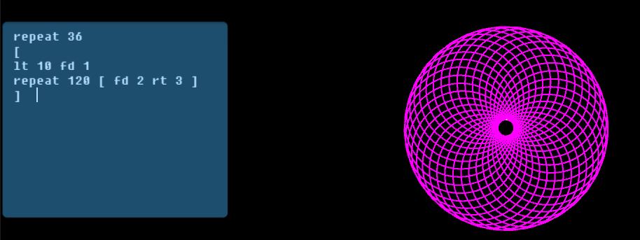

# Turtl3D | Experimental 3D Logo Interpreter
Turtl3D is a C# interpreter for a modified version of the Logo programming language with 3D capabilities.

## Language
Logo is a very simple language to learn. A program in Logo is simply a series of commands (keywords) which control the turtle. Logo also provides the `repeat` keyword for repeating a command multiple times, as well as an `if` keyword for conditional statements. The `up` and `dn` keywords are unique in this implementation of Logo as they allow the turtle to traverse in 3D. 

|Keyword|Description|
|-|-|
|`fd NUM`| Forward: Move turtle forward by NUM units.|
|`bk NUM`| Backward: Move turtle backward by NUM units.|
|`lt NUM`| Left: Rotate turtle left by NUM degrees.|
|`rt NUM`| Right: Rotate turtle right by NUM degrees.|
|`up NUM`| Up: Rotate turtle upwards (from Z axis, 3D) by NUM degrees.|
|`dn NUM`| Down: Rotate turtle downwards (from Z axis, 3D) by NUM degrees.|
|`repeat NUM [ ... ]`| Repeat the commands (enclosed in the square brackets `[...]`) by NUM number of times.|

